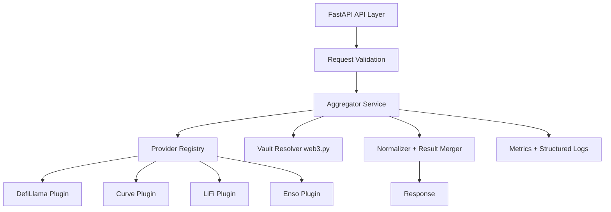

# Ethereum Token Price Aggregator - SPEC

Status: Draft v1
Last Updated: 2026-03-04
Target Stack: Python 3.12+, FastAPI, httpx, pydantic v2, web3.py

## 1. Objective
Build a simple, fast, and highly reliable Ethereum token price and quote aggregator with a plugin architecture.

The service must:
- Query multiple providers with different schemas and normalize outputs.
- Return per-provider results for `price` and `quote` requests.
- Support selecting one provider, a subset of providers, or default to all enabled providers.
- Handle unsupported tokens gracefully per provider.
- Support `use_underlying=true` to resolve and value vault shares via on-chain data (ERC-4626 and Yearn v2 style vaults).

## 2. Scope
### 2.1 MVP (as soon as functional)
- Endpoints for `price` and `quote`.
- Provider plugins:
  - `defillama` (price)
  - `curve` (price + quote)
  - `lifi` (price + quote)
  - `enso` (price + quote)
- Provider API-key auth for upstreams that require it:
  - `LIFI_API_KEY`
  - `ENSO_API_KEY`
- Parallel fan-out across providers.
- Standard normalized response shape with per-provider status.
- Vault-aware conversion (`use_underlying`) using web3.py:
  - ERC-4626 vaults: `asset()`, conversion functions.
  - Yearn v2 style vaults: `token()`, `pricePerShare()`.
- Strong input validation and deterministic error handling.
- Unit + integration tests.

### 2.2 Deferred to Phase 2
- Consumer-facing API authentication/authorization for this service.
- Rate limiting.
- Response caching and advanced metadata caching.
- Persistent data store.

## 3. Non-goals (MVP)
- Best-price execution engine.
- Transaction building or on-chain execution.
- Cross-chain routing (initially Ethereum mainnet only).
- Historical OHLC/time-series storage.

## 4. Key Design Principles
- Reliability first: partial provider failures are expected and must be explicit in provider-level statuses.
- Deterministic outputs: same input, same normalized structure.
- Provider isolation: one provider cannot break the whole request.
- Strict typing and schema validation at every boundary.
- Async-first architecture for low latency and high concurrency.
- Clear separation of concerns: API, orchestration, provider adapters, vault resolution.

## 5. External Providers and IDs
Provider IDs are stable short strings used in request params and responses.

- `defillama`
  - Price docs: https://api-docs.defillama.com/#tag/coins/get/prices/current/{coins}
- `curve`
  - Price docs: https://prices.curve.finance/v1/usd_price/ethereum/0xd533a949740bb3306d119cc777fa900ba034cd52
  - Quote docs: https://www.curve.finance/api/router/v1/routes?chainId=1&tokenIn=0xeeeeeeeeeeeeeeeeeeeeeeeeeeeeeeeeeeeeeeee&tokenOut=0xa0b86991c6218b36c1d19d4a2e9eb0ce3606eb48&amountIn=1000000000000000000&router=curve
- `lifi`
  - Price docs: https://docs.li.fi/api-reference/fetch-information-about-a-token
  - Quote docs: https://docs.li.fi/api-reference/get-a-quote-for-a-token-transfer
  - Auth: requires `LIFI_API_KEY` from environment
- `enso`
  - Price docs: https://docs.enso.build/api-reference/tokens/token-price
  - Quote docs: https://docs.enso.build/api-reference/defi-shortcuts/optimal-route-between-two-tokens
  - Auth: requires `ENSO_API_KEY` from environment

## 6. High-Level Architecture


### 6.1 Main Components
- API Layer (FastAPI): validates input, returns normalized output, exposes health endpoints.
- Aggregator Service: request orchestration, provider fan-out, timeout policy, result merge.
- Provider Plugins: provider-specific HTTP calls and response parsing.
- Vault Resolver: on-chain vault detection and share conversion.
- Normalization Layer: canonical token and result models.
- Observability: logs, metrics, request IDs, latency/error counters.

## 7. API Contract (MVP)

### 7.1 Endpoints
- `GET /v1/price`
- `GET /v1/quote`
- `GET /v1/providers`
- `GET /v1/health`

`GET /v1/providers` should expose runtime provider availability, including whether required upstream credentials are configured.

### 7.2 Common Request Fields (query params)
- `chain_id` (int, required): MVP supports `1` only.
- `providers` (list[str], optional): default all enabled providers.
  - Supports repeated query params and comma-separated values.
- `use_underlying` (bool, optional, default `false`): enables vault conversion logic.
- If `use_underlying` is omitted, service behaves as `use_underlying=false`.

### 7.2.1 Address Casing Rules (MVP)
- Request token addresses are case-insensitive (`0xabc...`, `0xAbC...`, `0xABC...` all accepted if otherwise valid).
- Service normalizes all EVM addresses to checksum format at validation boundary.
- All response address fields must be checksummed EIP-55 strings.
- Native token aliases are accepted case-insensitively and returned as one canonical alias string.

### 7.2.2 Provider Credential Config (MVP)
- `LIFI_API_KEY` (required to enable `lifi`)
- `ENSO_API_KEY` (required to enable `enso`)

Startup behavior:
- Missing required API key does not crash the service.
- Provider is marked disabled/unavailable with reason `missing_api_key`.
- Requests that explicitly target a disabled provider return `invalid_request` for that provider.

### 7.3 Price Request
`GET /v1/price` query params:
- `chain_id` (required)
- `token` (required)
- `providers` (optional)
- `use_underlying` (optional, default `false`)

Example:
`/v1/price?chain_id=1&token=0xD533a949740bb3306d119CC777fa900bA034cd52&providers=defillama,curve`

Notes:
- `use_underlying` is optional; if omitted it defaults to `false`.
- With `use_underlying=true`, `token` is interpreted as vault share token and valued via underlying.

### 7.4 Quote Request
`GET /v1/quote` query params:
- `chain_id` (required)
- `token_in` (required)
- `token_out` (required)
- `amount_in` (required)
- `providers` (optional)
- `include_route` (optional, default `false`)
- `use_underlying` (optional, default `false`)

Example:
`/v1/quote?chain_id=1&token_in=0xEeeeeEeeeEeEeeEeEeEeeEEEeeeeEeeeeeeeEEeE&token_out=0xA0b86991c6218b36c1d19D4a2e9Eb0cE3606eB48&amount_in=1000000000000000000&providers=curve,enso`

Notes:
- MVP quote mode is exact-in only.
- `amount_in` is required and in base units.
- `use_underlying` is optional; if omitted it defaults to `false`.
- With `use_underlying=true`, vault tokens are converted to underlying for provider quoting; output includes conversion details.

### 7.5 Unified Response Shape
```json
{
  "request_id": "b455137d-8582-486e-aa5e-1cb7d2f12f2f",
  "chain_id": 1,
  "token": {
    "chain_id": 1,
    "address": "0xD533a949740bb3306d119CC777fa900bA034cd52",
    "symbol": "CRV",
    "decimals": 18,
    "logo_url": "https://assets.smold.app/api/token/1/0xD533a949740bb3306d119CC777fa900bA034cd52/logo-128.png"
  },
  "provider_order": ["curve", "defillama"],
  "price_data": {
    "provider": "curve",
    "price": "0.987654321",
    "latency_ms": 84,
    "as_of": "2026-03-04T13:21:05Z",
    "retrieved_at": "2026-03-04T13:21:06Z",
    "vault_context": null
  },
  "providers": {
    "curve": {
      "status": "ok",
      "success": true,
      "price": "0.987654321",
      "latency_ms": 84,
      "as_of": "2026-03-04T13:21:05Z",
      "retrieved_at": "2026-03-04T13:21:06Z",
      "error": null,
      "vault_context": null
    },
    "defillama": {
      "status": "ok",
      "success": true,
      "price": "0.987600000",
      "latency_ms": 61,
      "as_of": "2026-03-04T13:21:04Z",
      "retrieved_at": "2026-03-04T13:21:06Z",
      "error": null,
      "vault_context": null
    }
  },
  "summary": {
    "requested_providers": 2,
    "successful_providers": 2,
    "failed_providers": 0
  }
}
```

### 7.6 Provider Status Enum
- `ok`
- `unsupported_token`
- `timeout`
- `upstream_error`
- `rate_limited`
- `invalid_request`
- `internal_error`
- `stale`

## 8. Domain Models (Normalized)

### 8.1 Canonical TokenRef
- `chain_id: int`
- `address: str` (EIP-55 checksum)
- `symbol: str | None`
- `decimals: int | None`

`TokenRef.address` is always normalized before entering core orchestration and remains checksummed in all downstream models.

### 8.2 Canonical PriceResult
- `provider: str`
- `status: ProviderStatus`
- `token: TokenRef`
- `price_usd: Decimal | None`
- `latency_ms: int`
- `as_of: datetime | None`
- `error: ErrorInfo | None`
- `raw: dict | None` (debug only, optional, off by default)

### 8.3 Canonical QuoteResult
- `provider: str`
- `status: ProviderStatus`
- `token_in: TokenRef`
- `token_out: TokenRef`
- `amount_in: int`
- `amount_out: int | None`
- `amount_out_min: int | None`
- `price_impact_bps: int | None`
- `estimated_gas: int | None`
- `latency_ms: int`
- `as_of: datetime | None`
- `error: ErrorInfo | None`
- `route: dict | None`

## 9. Plugin Architecture

### 9.1 Provider Plugin Interface
```python
from abc import ABC, abstractmethod
from typing import ClassVar

class ProviderPlugin(ABC):
    id: ClassVar[str]
    supports_price: ClassVar[bool] = False
    supports_quote: ClassVar[bool] = False

    @abstractmethod
    async def get_price(self, req: "ProviderPriceRequest") -> "PriceResult":
        raise NotImplementedError

    @abstractmethod
    async def get_quote(self, req: "ProviderQuoteRequest") -> "QuoteResult":
        raise NotImplementedError
```

### 9.2 Registry
- Static registry map for MVP: `{provider_id: plugin_instance}`.
- Unknown provider IDs fail validation with `400`.
- Disabled provider IDs filtered by config.
- Plugins with missing required credentials are loaded as unavailable with explicit reason.

### 9.3 Provider Isolation Rules
- Independent timeout per provider.
- Exception boundaries per provider call.
- One provider failure never aborts the whole aggregate response.

### 9.4 Capability Manifest
Each plugin exposes a capability manifest so orchestration can pre-filter unsupported operations before network calls.

Example:
```json
{
  "id": "defillama",
  "supports_price": true,
  "supports_quote": false,
  "chains": [1]
}
```

### 9.5 Upstream Auth Injection
- Provider plugins receive typed credential config via dependency injection (not by reading env vars directly inside request handlers).
- Credentials are attached as provider-specific headers/query params in a shared HTTP client wrapper.
- Secrets are never logged.

## 10. Request Flow

### 10.1 Price Flow
1. Validate request.
2. Normalize token format (including case-insensitive address -> EIP-55 checksum).
3. If `use_underlying=true`, resolve underlying token + share conversion via Vault Resolver.
4. Fan out async calls to selected providers supporting price.
5. Normalize provider responses.
6. Return merged results + partial indicator.

### 10.2 Quote Flow
1. Validate request.
2. Normalize token/amount inputs (including case-insensitive address -> EIP-55 checksum).
3. If `use_underlying=true`, resolve and convert vault tokens to underlying for quote.
4. Fan out async calls to selected providers supporting quote.
5. Normalize and convert back when output token is vault (if needed).
6. Return merged results + partial indicator.

### 10.3 Aggregation Semantics
- Price requests return all provider results plus summary fields.
- Summary fields for price:
    - `median_price`: median of non-null prices
  - `deviation_bps`: spread between min and max (if >=2 successful providers)
- Quote requests return all provider results plus:
  - `best_amount_out`: max non-null `amount_out`
  - `best_provider`: provider id that produced `best_amount_out`
- Quotes are not blindly comparable unless same input assumptions; response should include provider disclaimers when available.

### 10.4 Deterministic Ordering
- `provider_order` is deterministic and always returned.
- Top-level `price_data`/`quote` selection uses `provider_order` precedence.
- `providers` object keys should be interpreted using `provider_order` for ordered display.

## 11. Vault Resolver (web3.py)

### 11.1 MVP Vault Types
- ERC-4626 vaults.
- Yearn v2 style vaults (`token()`, `pricePerShare()`).

### 11.2 Detection Strategy
For a token address when `use_underlying=true`:
1. Attempt ERC-4626 detection:
   - Call `asset()` and `decimals()`.
   - Call `convertToAssets(10**share_decimals)` (or `previewRedeem` fallback).
2. If that fails, attempt Yearn v2 detection:
   - Call `token()`, `pricePerShare()`, `decimals()`.
3. If both fail, return `invalid_request` with clear error.

### 11.3 Conversion Rules
- Share -> underlying amount must be integer-safe and deterministic.
- Use Decimal only for display math; keep base-unit values as integers.
- Include `vault_context` in response:
  - `vault_type`
  - `underlying_token` (checksummed address)
  - `share_to_asset_rate`
  - block number used

### 11.4 RPC Reliability
- Use `AsyncWeb3` with configurable RPC URL list.
- Timeout and retry policy for read calls.
- Optional failover to secondary RPC on transport errors.

## 12. Reliability and Resilience

### 12.1 Timeouts and Retries
- Per-provider HTTP timeout: default 800 ms (configurable).
- Max 1 retry for transient network errors/timeouts.
- No retries for deterministic 4xx errors.

### 12.2 Circuit Breaker (MVP-light)
- Track rolling failures per provider.
- Open breaker after threshold (e.g. 5 failures/30s).
- Half-open probe after cooldown.
- Open breaker returns `upstream_error` immediately for that provider.

### 12.3 Partial Results
- API returns successful provider data even when others fail.
- Per-provider failure status is surfaced under `providers.{provider_id}.status` and `error`.

### 12.4 Input Validation Hard Rules
- `chain_id` must be supported.
- Token addresses must be valid EVM addresses or approved native alias.
- Address validation is case-insensitive; normalized checksum form is required in all internal and response models.
- `amount_in` must be a positive integer string.
- Providers list must be non-empty after filtering.

### 12.5 Concurrency and Bulkheads
- Request-level provider fan-out is bounded by semaphore (default 8).
- Global in-flight provider calls are bounded (default 200).
- Web3 vault RPC calls use separate semaphore to avoid starving HTTP provider calls.
- When concurrency bounds are hit, fail fast with `429` or `internal_error` based on configured policy.

## 13. Performance Targets (MVP)
- `GET /v1/price` (single token, all providers): p95 < 900 ms.
- `GET /v1/quote` (single pair, all quote-capable providers): p95 < 1200 ms.
- In-process memory footprint stable under sustained load.

Assumptions:
- Targets depend on upstream provider latency and RPC quality.

## 14. Observability

### 14.1 Logging
Structured JSON logs with:
- `request_id`
- endpoint
- provider
- latency
- status
- error_code

### 14.2 Metrics
Prometheus-style metrics:
- request count/latency by endpoint
- provider call latency histogram
- provider error counts by status code/type
- vault resolution latency and failures
- partial response rate

### 14.3 Tracing (optional in MVP)
OpenTelemetry hooks for provider fan-out span visibility.

### 14.4 Alerting (recommended)
- Alert when partial response rate exceeds threshold for 5m window.
- Alert when a provider breaker remains open longer than cooldown x 3.
- Alert on p95 latency regression beyond target by endpoint.

## 15. Security and Safety
- No signing keys or transaction execution in service.
- Strict allowlist of upstream provider base URLs.
- Reject malformed addresses and oversized payloads.
- Cap max providers per request to configured limit.
- Sanitize and bound all timeout/retry settings.

### 15.1 Numerical Safety
- Never use floating point for token or quote amounts.
- Use `Decimal` for human-readable USD math.
- Keep canonical transport amounts as integer strings in base units.

### 15.2 Data Freshness Guardrails
- If provider returns stale timestamp beyond freshness window, mark result `stale`.
- Include `as_of` and `retrieved_at` to separate upstream timestamp from local retrieval time.

### 15.3 Secret Handling
- Provider API keys come from environment (`.env` in local dev, secret manager in deployed envs).
- Do not echo API keys in logs, traces, or error payloads.
- Redact auth headers in HTTP client debug output.

## 16. Proposed Project Structure
```text
token_price_agg/
  app/
    main.py
    config.py
    dependencies.py
  api/
    routes/
      prices.py
      quotes.py
      providers.py
      health.py
    schemas/
      requests.py
      responses.py
  core/
    aggregator.py
    models.py
    errors.py
    normalizer.py
    validator.py
  providers/
    base.py
    registry.py
    defillama.py
    curve.py
    lifi.py
    enso.py
    clients/
      http.py
  vault/
    resolver.py
    adapters/
      erc4626.py
      yearn_v2.py
    abi/
      erc20.json
      erc4626.json
      yearn_v2_vault.json
  web3/
    client.py
    multicall.py
  observability/
    logging.py
    metrics.py
  tests/
    unit/
    integration/
    e2e/
```

## 17. Testing Strategy

### 17.1 Unit Tests
- Request validation and normalization.
- Provider parser/mapper correctness per plugin.
- Vault conversion math and edge rounding.
- Error mapping to provider status enum.

### 17.2 Integration Tests
- Mock upstream providers (httpx + respx) for success/failure/timeout cases.
- Verify partial responses and deterministic sorting.
- Verify `use_underlying=true` workflows with mocked web3 calls.
- Verify provider enable/disable behavior when `LIFI_API_KEY` / `ENSO_API_KEY` are present or missing.

### 17.3 Chain-aware Tests
- Forked mainnet tests (anvil or equivalent) for:
  - ERC-4626 sample vaults.
  - Yearn v2 vault sample (`pricePerShare`).
- Assert conversion formulas against known expected values.

### 17.4 E2E/API Tests
- Test full FastAPI app with TestClient.
- Cover all provider selection modes:
  - single provider
  - subset
  - all (default)

### 17.5 Reliability Tests
- Fault injection: provider timeout, malformed payload, 429, 500.
- Ensure aggregator still returns non-failing provider results.

## 18. Implementation Plan

### Milestone 1: Skeleton + Contracts
- Build typed models, error taxonomy, provider interface, registry, FastAPI routes.
- Implement typed settings loader for provider API keys and provider availability state.
- Add dummy provider plugin for shape validation.
- Deliver unit tests for API schemas and aggregator orchestration.

### Milestone 2: Price Providers
- Implement `defillama` and `curve` price plugins first.
- Add `lifi` and `enso` price plugins.
- Validate unsupported token handling.

### Milestone 3: Quote Providers
- Implement `curve`, `lifi`, `enso` quote plugins.
- Normalize route and amount fields.

### Milestone 4: Vault Layer
- Implement ERC-4626 adapter.
- Implement Yearn v2 adapter.
- Add conversion context in responses.

### Milestone 5: Hardening
- Add retries, circuit breaker, better metrics.
- Load/stress tests and p95 tuning.
- Prepare Phase 2 hooks for consumer auth/rate-limit/cache.

### Definition of Done for MVP
- All four provider plugins implemented with contract tests.
- `prices` and `quotes` endpoints stable and documented.
- `lifi` and `enso` credential handling implemented via `LIFI_API_KEY` and `ENSO_API_KEY`.
- `use_underlying=true` supports ERC-4626 and Yearn v2 on mainnet with integration tests.
- Partial failure handling verified by fault-injection integration tests.
- CI green on unit + integration + e2e suites.
- Basic runbook and configuration docs available.

## 19. Major Design Risks and Constraints
- Upstream schema drift: provider APIs may change fields without notice.
- Quote comparability: providers may include different fee/gas assumptions.
- Native token conventions differ (`0xeeee...`, zero address, symbol aliases).
- Vault math edge cases vary by implementation and decimals.
- RPC instability directly impacts `use_underlying=true` reliability.

Mitigations:
- Strict per-plugin mappers + schema validation.
- Adapter-specific tests with recorded fixtures.
- Clear response metadata so consumers understand differences.

## 20. Open Questions (Need Your Decision)
1. Should the API return only per-provider raw-normalized results, or also compute a "best" aggregate answer ("best" summary fields) in MVP?
2. For `use_underlying=true`, should conversion apply to both `token_in` and `token_out` automatically, or only for the specific token field explicitly marked by caller?
3. Should quote responses include provider route details by default, or only behind a debug flag to keep payloads small?
4. Do you want strict fail behavior (`HTTP 4xx/5xx`) when all providers fail, or always `200` with per-provider failures?
5. Is Ethereum mainnet-only sufficient for MVP, or should we make chain support pluggable now even if only `chain_id=1` is enabled?
6. For Yearn v2 share conversion, do you want us to enforce a curated allowlist of known vaults initially for safety?

## 21. Recommended Defaults (if you defer)
If you prefer me to decide, use these defaults:
- Return per-provider results and include computed summary best values.
- Apply vault conversion automatically to both input and output tokens when they are vaults.
- Include route details only when `include_route=true`.
- Return `200` with detailed per-provider statuses even when all fail.
- Build chain-pluggable architecture now, enable only mainnet in config.
- Start Yearn v2 with both detection logic and optional allowlist flag.
